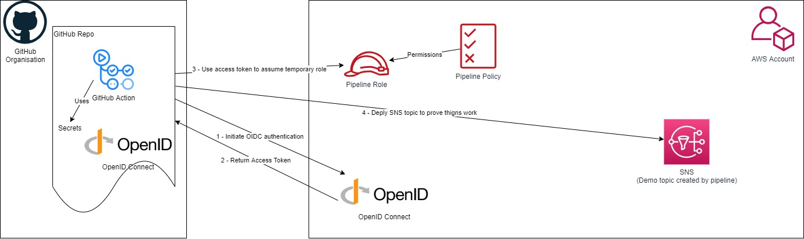

# aws-github-oidc
Repo using OIDC to authenticate to AWS from GitHub Actions

This repo will create Open ID Connect in AWS and link it to GitHub, along with a role with permissions for GitHub to assume to provision resources.
This repo also includes a GitHub action which implements logging in with Open ID Connect, and then creates an SNS topic to provide it works

Instructions: -
  - Authenticate to AWS account you want to deploy to using your typical method (temp creds, access key / secret access key etc)
  - Run the folliwing commands
    - terraform init
    - terraform apply
      - enter the region, github org and github repo you're deploying from
  - Add the following GitHub Secrets to your repository (within GitHub repo go to settings, secrets and create new secrets)
    - AWS_REGION - set the region you want to deploy to
    - AWS_ACCOUNT_ID - set as the AWS account number you've deployed the Terraform code to
  - Run the GitHub action that can now authenticate using OIDC
    - Navigate to GitHub actions and select 'Login to AWS using OIDC'
    - Select 'Run Workflow', set to branch you're working from and select 'Run workflow'
    - Navigate to GitHub action 'AWS using OIDC' and review the logs created by the runner

Please see my [blog article](https://markrosscloud.medium.com/using-open-id-connect-to-authenticate-to-aws-from-github-acd46bf1727e) for more information.